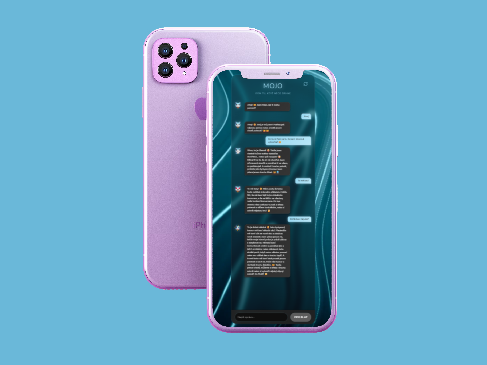

# 🐱 Mojo Chatbot



A modern, interactive AI chatbot built with React and powered by Groq API. Mojo is a friendly turquoise cat assistant that provides helpful responses with personality and style.


## ✨ Features

- **🤖 AI-Powered Responses** - Integration with Groq API (Llama 3.3 70B model)
- **⌨️ Typewriter Effect** - Smooth character-by-character message animation
- **😺 Mood Detection** - Dynamic avatar changes based on conversation context (10 different moods)
- **🎨 Glassmorphism Design** - Modern UI with frosted glass effects and gradient animations
- **📱 Fully Responsive** - Optimized for desktop, tablet, and mobile devices
- **♿ Accessibility** - ARIA labels and keyboard navigation support
- **💾 Session Persistence** - Conversation history maintained during session
- **🎯 Smart Focus Management** - Auto-focus on input field for better UX
- **⚡ Skip Animation** - Click messages to instantly display full text

## 🛠️ Tech Stack

- **React** 18.3.1 - UI library
- **Vite** 6.0.3 - Build tool and dev server
- **Groq API** - LLM provider (Llama 3.3 70B Versatile)
- **React Icons** - Icon library (Lucide React)
- **CSS3** - Styling with custom properties and animations

## 📦 Installation

### Prerequisites

- Node.js 18+ and npm/yarn
- Groq API key (get one at [console.groq.com](https://console.groq.com))

### Setup

1. Clone the repository

    ```bash
    git clone <your-repo-url>
    cd mojo-chatbot
    ```

2. Install dependencies

    ```bash
    npm install
    ```

3. Configure API proxy

The project uses a proxy server to handle Groq API calls. Update the `API_URL` in `src/services/groqService.js`:

```javascript
const API_URL = 'https://your-proxy-url.vercel.app/api/chat';
```

## 🚀 Development

Start the development server:

```bash
npm run dev
```

The app will be available at `http://localhost:5173`

## 🏗️ Build

Create a production build:

```bash
npm run build
```

Preview the production build:

```bash
npm run preview
```

## 📁 Project Structure

```mojo-chatbot/
├── public/
│   ├── avatars/          # Mood-based avatar images
│   └── img/              # Background images
├── src/
│   ├── components/
│   │   ├── Chatbot.jsx           # Main chatbot component
│   │   ├── Chatbot.css           # Chatbot styling
│   │   ├── TypewriterMessage.jsx # Typewriter animation component
│   │   └── TypewriterMessage.css # Typewriter styling
│   ├── services/
│   │   └── groqService.js        # Groq API integration
│   ├── utils/
│   │   └── detectMood.js         # Mood detection logic
│   ├── App.jsx           # Root component
│   ├── index.css         # Global styles
│   └── main.jsx          # Entry point
├── index.html
├── vite.config.js
└── package.json
```

## ⚙️ Configuration

### Groq API Parameters

Modify parameters in `src/services/groqService.js`:

```javascript
{
  model: 'llama-3.3-70b-versatile',
  temperature: 0.9,          // Creativity level (0-2)
  top_p: 0.95,              // Nucleus sampling
  max_tokens: 400,          // Response length limit
  presence_penalty: 0.3,    // Topic diversity
  frequency_penalty: 0.4    // Repetition penalty
}
```

### Typewriter Speed

Adjust typing speed in `src/components/Chatbot.jsx`:

```javascript
<TypewriterMessage
  cps={18}              // Characters per second
  startDelay={250}      // Initial delay (ms)
  showCaret={true}      // Show blinking cursor
  enableSkip={true}     // Allow click to skip
/>
```

### Mood Detection

Add or modify mood keywords in `src/utils/detectMood.js`:

```javascript
const partyKeywords = [
  'hurá', 'oslav', 'gratuluj', 'výhra', // Add your keywords
];
```

## 🎨 Customization

### Color Scheme

Edit CSS variables in `src/index.css`:

```css
:root {
  --leo-primary: #94d7f1;      /* Main accent color */
  --leo-secondary: #d5192e;    /* Button color */
  --leo-bg: #1a1a1a;           /* Background */
  --leo-text: #e0e0e0;         /* Text color */
}
```

### System Prompt

Customize the AI personality in `src/services/groqService.js`:

```javascript
{
  role: 'system',
  content: 'You are MOJO, a turquoise cat. You are an AI assistant...'
}
```

## 🌐 Deployment

### Vercel

1. Push your code to GitHub
2. Import project in Vercel
3. Configure environment variables
4. Deploy

## 📝 API Proxy Setup

For security, API calls go through a proxy server. Here's a basic example:

```javascript
// api/chat.js (Vercel Serverless Function)
export default async function handler(req, res) {
  const response = await fetch('https://api.groq.com/openai/v1/chat/completions', {
    method: 'POST',
    headers: {
      'Authorization': `Bearer ${process.env.GROQ_API_KEY}`,
      'Content-Type': 'application/json',
    },
    body: JSON.stringify(req.body)
  });
  
  const data = await response.json();
  res.status(200).json(data);
}
```

## 🤝 Contributing

Contributions are welcome! Please feel free to submit a Pull Request.

## 📄 License

This project is licensed under the MIT License.

## 🙏 Acknowledgments

- Groq for providing the AI infrastructure
- React team for the excellent framework
- Vite team for the blazing fast build tool

## 📧 Contact

For questions or feedback, please open an issue on GitHub.

---

Made with ❤️ and React
